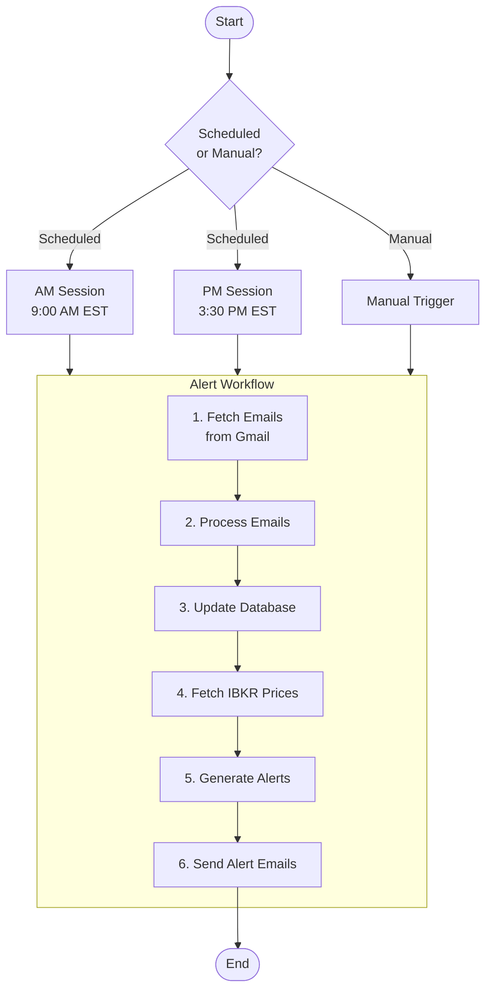
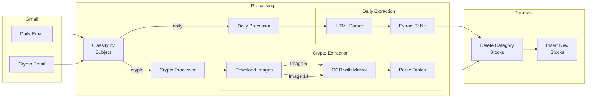
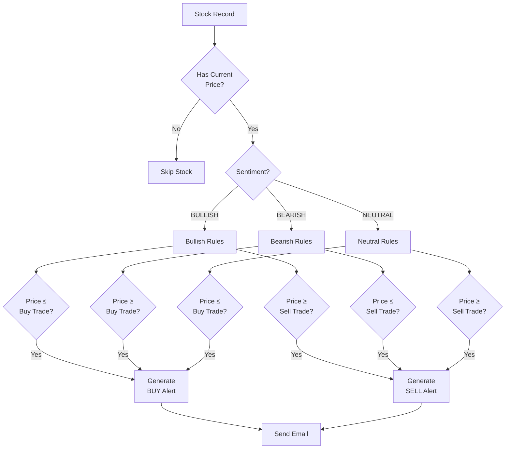
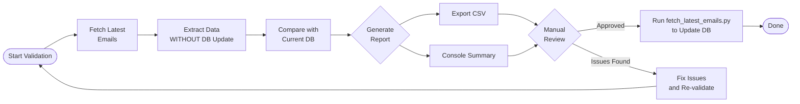
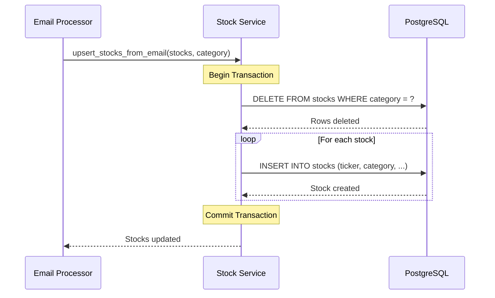
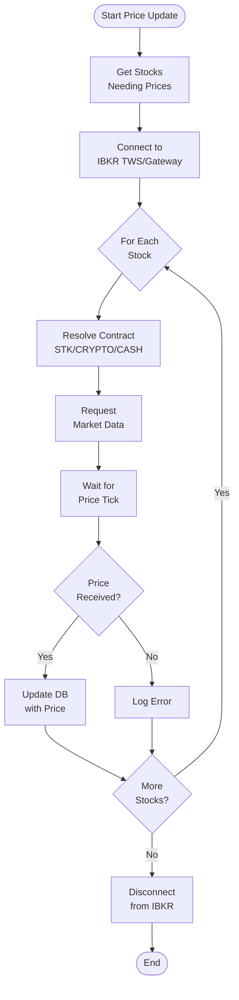
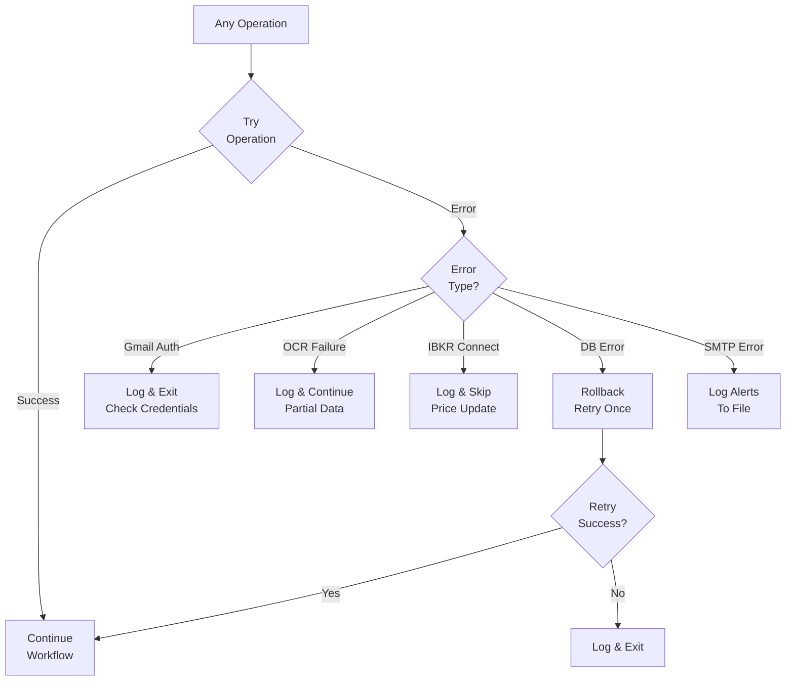
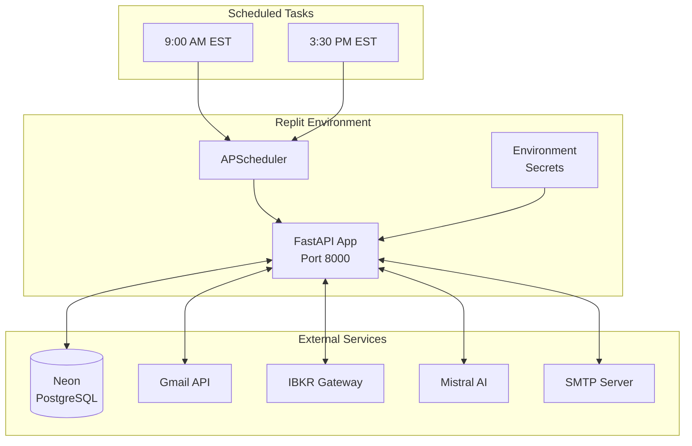

# HE Alerts System Flow Diagrams

## Complete System Flow

## Email Processing Detail

## Alert Generation Logic

## Validation Workflow

## Database Operations

## IBKR Price Update Flow

## Error Handling

## Deployment Architecture

